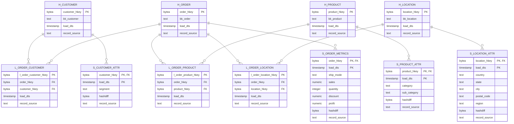

## Data Vault Design (Sample Superstore)

**Легенда:**
- **Синий** — Хабы (Hubs) — бизнес-ключи
- **Зеленый** — Линки (Links) — связи
- **Оранжевый** — Спутники (Satellites) — атрибуты

```mermaid
%%{init: {'theme':'default'}}%%
erDiagram
    H_CUSTOMER ||--o{ L_ORDER_CUSTOMER : ""
    H_ORDER ||--o{ L_ORDER_CUSTOMER : ""
    H_ORDER ||--o{ L_ORDER_PRODUCT : ""
    H_PRODUCT ||--o{ L_ORDER_PRODUCT : ""
    H_ORDER ||--o{ L_ORDER_LOCATION : ""
    H_LOCATION ||--o{ L_ORDER_LOCATION : ""
    H_CUSTOMER ||--o{ S_CUSTOMER_ATTR : ""
    H_PRODUCT ||--o{ S_PRODUCT_ATTR : ""
    H_LOCATION ||--o{ S_LOCATION_ATTR : ""
    H_ORDER ||--o{ S_ORDER_METRICS : ""

    H_CUSTOMER {
        bytea customer_hkey PK
        text bk_customer
        timestamp load_dts
        text record_source
    }
    
    H_PRODUCT {
        bytea product_hkey PK
        text bk_product
        timestamp load_dts
        text record_source
    }
    
    H_LOCATION {
        bytea location_hkey PK
        text bk_location
        timestamp load_dts
        text record_source
    }
    
    H_ORDER {
        bytea order_hkey PK
        text bk_order
        timestamp load_dts
        text record_source
    }
    
    L_ORDER_CUSTOMER {
        bytea l_order_customer_hkey PK
        bytea order_hkey FK
        bytea customer_hkey FK
        timestamp load_dts
        text record_source
    }
    
    L_ORDER_PRODUCT {
        bytea l_order_product_hkey PK
        bytea order_hkey FK
        bytea product_hkey FK
        timestamp load_dts
        text record_source
    }
    
    L_ORDER_LOCATION {
        bytea l_order_location_hkey PK
        bytea order_hkey FK
        bytea location_hkey FK
        timestamp load_dts
        text record_source
    }
    
    S_CUSTOMER_ATTR {
        bytea customer_hkey "PK, FK"
        timestamp load_dts "PK"
        text segment
        bytea hashdiff
        text record_source
    }
    
    S_PRODUCT_ATTR {
        bytea product_hkey "PK, FK"
        timestamp load_dts "PK"
        text category
        text sub_category
        bytea hashdiff
        text record_source
    }
    
    S_LOCATION_ATTR {
        bytea location_hkey "PK, FK"
        timestamp load_dts "PK"
        text country
        text state
        text city
        text postal_code
        text region
        bytea hashdiff
        text record_source
    }
    
    S_ORDER_METRICS {
        bytea order_hkey "PK, FK"
        timestamp load_dts "PK"
        text ship_mode
        numeric sales
        integer quantity
        numeric discount
        numeric profit
        bytea hashdiff
        text record_source
    }
```

