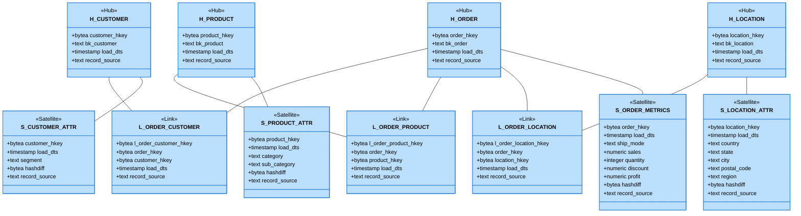

## Data Vault Design (Sample Superstore)

**Легенда:**
- **Хабы (Hubs)** — бизнес-ключи сущностей
- **Линки (Links)** — связи между хабами
- **Спутники (Satellites)** — атрибуты и метрики

```mermaid
%%{init: {'theme':'base', 'themeVariables': {'primaryColor':'#bbdefb','primaryTextColor':'#000','primaryBorderColor':'#1976d2','secondaryColor':'#c8e6c9','secondaryBorderColor':'#388e3c','tertiaryColor':'#ffe0b2','tertiaryBorderColor':'#f57c00'}}}%%
classDiagram
    class H_CUSTOMER {
        <<Hub>>
        +bytea customer_hkey
        +text bk_customer
        +timestamp load_dts
        +text record_source
    }
    
    class H_PRODUCT {
        <<Hub>>
        +bytea product_hkey
        +text bk_product
        +timestamp load_dts
        +text record_source
    }
    
    class H_LOCATION {
        <<Hub>>
        +bytea location_hkey
        +text bk_location
        +timestamp load_dts
        +text record_source
    }
    
    class H_ORDER {
        <<Hub>>
        +bytea order_hkey
        +text bk_order
        +timestamp load_dts
        +text record_source
    }
    
    class L_ORDER_CUSTOMER {
        <<Link>>
        +bytea l_order_customer_hkey
        +bytea order_hkey
        +bytea customer_hkey
        +timestamp load_dts
        +text record_source
    }
    
    class L_ORDER_PRODUCT {
        <<Link>>
        +bytea l_order_product_hkey
        +bytea order_hkey
        +bytea product_hkey
        +timestamp load_dts
        +text record_source
    }
    
    class L_ORDER_LOCATION {
        <<Link>>
        +bytea l_order_location_hkey
        +bytea order_hkey
        +bytea location_hkey
        +timestamp load_dts
        +text record_source
    }
    
    class S_CUSTOMER_ATTR {
        <<Satellite>>
        +bytea customer_hkey
        +timestamp load_dts
        +text segment
        +bytea hashdiff
        +text record_source
    }
    
    class S_PRODUCT_ATTR {
        <<Satellite>>
        +bytea product_hkey
        +timestamp load_dts
        +text category
        +text sub_category
        +bytea hashdiff
        +text record_source
    }
    
    class S_LOCATION_ATTR {
        <<Satellite>>
        +bytea location_hkey
        +timestamp load_dts
        +text country
        +text state
        +text city
        +text postal_code
        +text region
        +bytea hashdiff
        +text record_source
    }
    
    class S_ORDER_METRICS {
        <<Satellite>>
        +bytea order_hkey
        +timestamp load_dts
        +text ship_mode
        +numeric sales
        +integer quantity
        +numeric discount
        +numeric profit
        +bytea hashdiff
        +text record_source
    }
    
    H_CUSTOMER -- L_ORDER_CUSTOMER
    H_ORDER -- L_ORDER_CUSTOMER
    H_ORDER -- L_ORDER_PRODUCT
    H_PRODUCT -- L_ORDER_PRODUCT
    H_ORDER -- L_ORDER_LOCATION
    H_LOCATION -- L_ORDER_LOCATION
    H_CUSTOMER -- S_CUSTOMER_ATTR
    H_PRODUCT -- S_PRODUCT_ATTR
    H_LOCATION -- S_LOCATION_ATTR
    H_ORDER -- S_ORDER_METRICS
```
