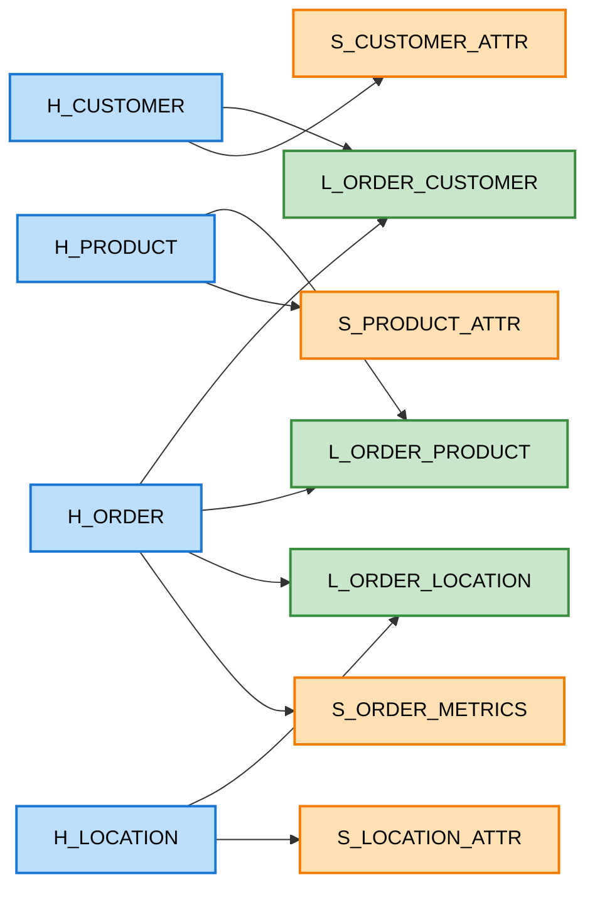

## Data Vault Design (Sample Superstore)

**Легенда:**
- **Синий** — Хабы (Hubs)
- **Зеленый** — Линки (Links)
- **Оранжевый** — Спутники (Satellites)

```mermaid
graph LR
    H_CUSTOMER[H_CUSTOMER]
    H_PRODUCT[H_PRODUCT]
    H_LOCATION[H_LOCATION]
    H_ORDER[H_ORDER]
    
    L_ORDER_CUSTOMER[L_ORDER_CUSTOMER]
    L_ORDER_PRODUCT[L_ORDER_PRODUCT]
    L_ORDER_LOCATION[L_ORDER_LOCATION]
    
    S_CUSTOMER_ATTR[S_CUSTOMER_ATTR]
    S_PRODUCT_ATTR[S_PRODUCT_ATTR]
    S_LOCATION_ATTR[S_LOCATION_ATTR]
    S_ORDER_METRICS[S_ORDER_METRICS]
    
    H_CUSTOMER --> L_ORDER_CUSTOMER
    H_ORDER --> L_ORDER_CUSTOMER
    H_ORDER --> L_ORDER_PRODUCT
    H_PRODUCT --> L_ORDER_PRODUCT
    H_ORDER --> L_ORDER_LOCATION
    H_LOCATION --> L_ORDER_LOCATION
    
    H_CUSTOMER --> S_CUSTOMER_ATTR
    H_PRODUCT --> S_PRODUCT_ATTR
    H_LOCATION --> S_LOCATION_ATTR
    H_ORDER --> S_ORDER_METRICS
    
    classDef hubStyle fill:#bbdefb,stroke:#1976d2,stroke-width:2px,color:#000
    classDef linkClass fill:#c8e6c9,stroke:#388e3c,stroke-width:2px,color:#000
    classDef satStyle fill:#ffe0b2,stroke:#f57c00,stroke-width:2px,color:#000
    
    class H_CUSTOMER,H_PRODUCT,H_LOCATION,H_ORDER hubStyle
    class L_ORDER_CUSTOMER,L_ORDER_PRODUCT,L_ORDER_LOCATION linkClass
    class S_CUSTOMER_ATTR,S_PRODUCT_ATTR,S_LOCATION_ATTR,S_ORDER_METRICS satStyle
```
