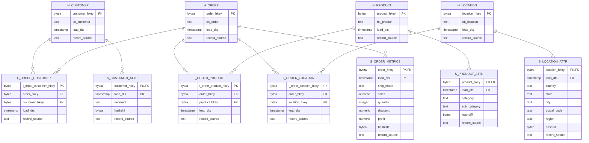

## Data Vault Design (Sample Superstore)

### Легенда
- **Хабы (Hubs)** — бизнес-ключи сущностей
- **Линки (Links)** — связи между хабами
- **Спутники (Satellites)** — атрибуты и метрики

---

### Модель данных

---

### Бизнес-ключи

**Hub Customer:** `segment|country|state|city|postal_code`  
**Hub Product:** `category|sub_category`  
**Hub Location:** `country|state|city|postal_code|region`  
**Hub Order:** `ship_mode|segment|country|state|city|postal_code|region|category|sub_category`

### Технические детали

- **Хеширование:** SHA-256 через `digest(..., 'sha256')`
- **hashdiff:** SHA-256 от всех атрибутов спутника
- **DISTRIBUTED BY:** hash-ключ для оптимизации JOIN
- **Type-2 SCD:** композитный PK (hkey, load_dts) в спутниках
